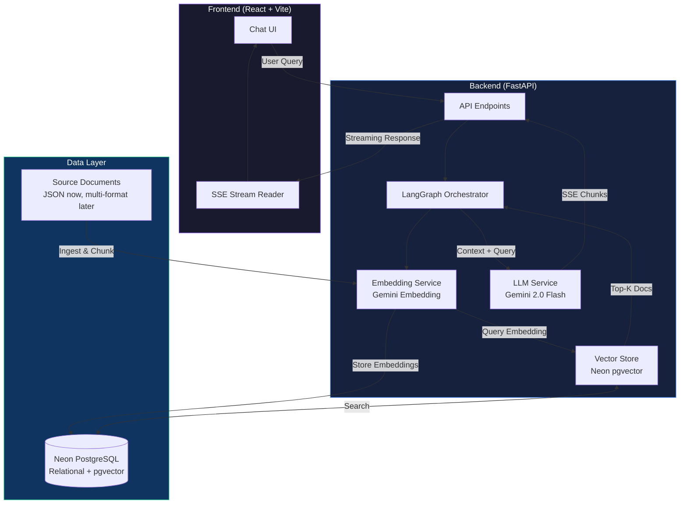
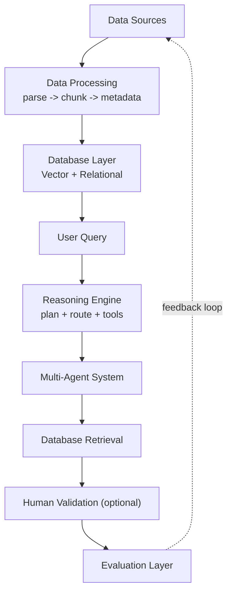

# 🧠 RAG System — Retrieval-Augmented Generation

A full-stack RAG system that retrieves relevant documents from a vector database and generates grounded responses using Google Gemini. Features **LangGraph orchestration**, **strict structured routing/planning/validation**, **SSE streaming**, a **React chat interface**, and a **built-in evaluation framework**.

> Built with FastAPI, LangGraph, Neon PostgreSQL (`pgvector`), Google Gemini, and React.

## Architecture



## End-to-End Flow (Roadmap)



### Implementation Status

- [x] Data Sources (Completed)
- [x] Data Processing (Completed)
- [x] Database Layer (Completed)
- [x] User Query (Guard implemented)
- [x] Reasoning Engine (plan + route + tools)
- [ ] Multi-Agent System
- [x] Database Retrieval (agentic retrieval loop)
- [ ] Human Validation (optional)
- [/] Evaluation Layer + feedback loop (Framework ready)

### Data Sources & Processing (Current Milestone)

- **Status**: ✅ Completed for current scope
- **Current source**: `backend/data/documents/SQuAD-small.json`
- **Processing flow**:
  1. Parse source file
  2. Split content into chunks
  3. Attach metadata per chunk
  4. Send chunks to embedding + database ingestion path
- **Notes**: This milestone is intentionally scoped to data input and processing only. Remaining layers are planned for future milestones.

### User Query (Current Guard)

- **Status**: ✅ Basic guard implemented
- **What is implemented now**:
  1. Normalize input by trimming and collapsing repeated whitespace
  2. Reject empty or whitespace-only query input
  3. Keep explicit request bounds (`max_length=1000`, `top_k` range)
- **Implementation**: `backend/services/query_guard.py` + `QueryRequest` validator in `backend/models.py`
- **Scope note**: Rate limits, intent gating, and confidence thresholds are planned in later milestones.

### Reasoning Engine (Current Milestone)

- **Status**: ✅ Implemented (Phase 1)
- **What is implemented now**:
  1. **LangGraph state machine** with explicit nodes:
     `ingest_query -> query_router -> planner -> tool_orchestrator -> writer -> validation_router -> decision_node -> finalize_response`
  2. **Strict structured control nodes** (Router/Planner/Validator) with schema validation and retry on schema failures.
  3. **Supported routes**: `direct`, `rag_simple`, `clarify`, `unsafe`.
  4. **Supported tools**: `vector_search`, `rerank`.
  5. **Validation loop**: `pass | revise | replan | fail_safe` with one retry and deterministic fail-safe fallback.
  6. **Safety parity across endpoints**: `/query` and `/query/stream` both run the same validation contract before returning user-visible answers.
- **Implementation**:
  - `backend/services/rag.py`
  - `backend/services/llm.py`
  - `backend/services/vector_store.py`
  - `backend/tests/test_rag_pipeline.py`
- **Scope note**: Multi-agent routing and additional external tools are intentionally out of scope for this milestone.

### Database Retrieval (Agentic Retrieval Loop)

- **Status**: ✅ Implemented for current scope
- **What is implemented now**:
  1. **Planner-directed retrieval loop** executes `vector_search` and optional `rerank` steps from plan budgets.
  2. **Evidence extraction and ranking** converts vector results into chunk-level evidence with relevance scores.
  3. **Agentic replan behavior** triggers when retrieval returns no evidence and retries once before fail-safe.
  4. **Circuit-breaker guard** fails safe when tool failure ratio exceeds threshold.
  5. **Endpoint parity**: `/query` and `/query/stream` both use the same validated graph result before responding.
- **Implementation**:
  - `backend/services/rag.py`
  - `backend/services/vector_store.py`
  - `backend/tests/test_rag_pipeline.py`
  - `backend/tests/test_vector_store.py`
- **Scope note**: This covers the single-agent retrieval loop over the active corpus. Multi-agent retrieval coordination remains a separate milestone.

### Evaluation Layer & Feedback Loop (Current Milestone)

- **Status**: ✅ Framework implemented
- **What is implemented now**:
  1. **Runner**: Automated execution engine (`runner.py`)
  2. **Judges**: LLM-based judges for Groundedness and Quality (`judges.py`)
  3. **Gates**: CI/CD quality gates with strict thresholds (`check_gates.py`)
  4. **Reports**: Detailed JSON/HTML artifacts for each run
- **Implementation**: `backend/evaluation/` directory
- **Scope note**: Feedback loop to Data Sources is currently manual. Automated retraining/re-indexing loops are planned for future milestones.

## Database Layer

The system uses a **Hybrid RAG** storage architecture, leveraging **Neon PostgreSQL** for both vector and relational data.

### 1. Vector Store (Embedding Retrieval)
- **Implementation**: Neon PostgreSQL with `pgvector` extension.
- **Purpose**: High-performance similarity search for document chunks.
- **Index**: HNSW (Hierarchical Navigable Small World) for efficient approximate nearest neighbor search.
- **Dimensionality**: 768 (matching Gemini Embedding 001).

### 2. Relational Database (Future Proofing)
- **Status**: Provisioned but currently minimal usage.
- **Capabilities**: Ready for structured metadata, queryable logs, and application state.
- **Current State**: The system is designed to be easily extensible to store chat history, user feedback, and detailed telemetry in relational tables side-by-side with the vectors.

### Key Features

- 🔍 **Semantic search** — Gemini embeddings with Neon PostgreSQL (`pgvector`)
- 🧭 **LangGraph state machine** — Routed execution with conditional edges and retry paths
- ✅ **Strict structured control nodes** — Schema-enforced Router/Planner/Validator outputs
- ⚡ **Streaming** — Token-by-token SSE streaming for real-time responses
- 📊 **Evaluation** — Built-in metrics framework (precision, recall, faithfulness)
- 🎨 **Chat UI** — Dark-mode React frontend with source citations
- 🐳 **Docker Compose** — One-command full-stack deployment
- 🚀 **CI/CD** — Automated deploy to Cloud Run (backend) and Firebase Hosting (frontend)

## RAG Plan Status

- [x] Phase 1 MVP checklist complete (QueryState, router, planner, tool_orchestrator, writer, relevance/groundedness validator, single retry loop)
- [x] LangGraph runtime integrated for orchestration
- [x] Strict schema-based Router/Planner/Validator output wired through Gemini JSON mode
- [x] Legacy SQLModel SQuAD ingestion path retained as an optional pipeline (not in main API runtime)
- [ ] Phase 2 (agent layer, completeness and citation checks, richer failure policies)
- [ ] Phase 3 (observability dashboards, caching/rate limiting, latency/cost tuning)

---

## Quick Start

### Option 1: Docker Compose (Recommended)

```bash
# 1. Clone and configure
git clone <repo-url> && cd coding-exercise
cp backend/.env.example backend/.env
# Edit backend/.env — set GEMINI_API_KEY and DATABASE_URL

# 2. Start everything
docker-compose up --build

# 3. Ingest documents
curl -X POST http://localhost:8000/ingest

# 4. Open the UI
open http://localhost:5173
```

### Option 2: Local Development

#### Backend (Terminal 1)

```bash
cd backend
python3 -m venv venv
source venv/bin/activate
pip install -r requirements.txt

# Configure your Gemini API key
cp .env.example .env
# Edit .env and set GEMINI_API_KEY + DATABASE_URL

# Ingest the source documents into Neon PostgreSQL (pgvector)
# Option A: Use the helper script (Recommended)
python scripts/ingest.py

# Option B: Use curl directly
# curl -X POST http://localhost:8000/ingest

# Start the backend server
uvicorn main:app --reload
# ✅ Backend running at http://localhost:8000
```

#### Frontend (Terminal 2)

```bash
cd frontend
npm install
# Optional: override API base for direct backend URL deployments
# export VITE_API_BASE=https://your-backend-host
npm run dev
# ✅ Frontend running at http://localhost:5173
```

> **Note:** Frontend requests default to `/api`.
> - Local dev (Vite): `/api` is proxied to `http://localhost:8000`
> - Docker (Nginx): `/api` is proxied to `http://backend:8000`
> - Direct-backend deployments: set `VITE_API_BASE` at build time

---

## API Endpoints

| Method | Path | Description |
|--------|------|-------------|
| `GET` | `/health` | Health check + model status |
| `POST` | `/query` | RAG query (JSON response) |
| `POST` | `/query/stream` | RAG query (SSE streaming) |
| `GET` | `/documents` | List indexed documents |
| `POST` | `/ingest` | Ingest documents from disk |

### Example Query

```bash
curl -X POST http://localhost:8000/query \
  -H "Content-Type: application/json" \
  -d '{"query": "Why is centering a div so hard?", "top_k": 3}'
```

---

## GitHub Actions Deploy Secrets

For backend auto-deploy (`.github/workflows/deploy-backend.yml`), set these repository secrets:

- `GCP_PROJECT_ID`
- `GCP_SA_KEY`
- `GEMINI_API_KEY`
- `DATABASE_URL` (Neon/Postgres connection string)

Without `DATABASE_URL`, Cloud Run startup will fail when `VectorStoreService` initializes.

---

## 📊 Evaluation & Quality Gates

The project includes a custom evaluation framework located in `backend/evaluation/`. It replaces heavier libraries like RAGAS with transparent, strict-schema LLM judges and heuristic metrics.

### 1. Running Evaluations

Run limits or full sweeps using the runner CLI entrypoint:

```bash
cd backend
# Run full evaluation (retrieval + LLM judges) with top-k=5
python -m evaluation.runner --mode full_rag_with_judges --top-k 5 --limit 10

# Run retrieval-only (faster, for experimenting with embeddings/chunking)
python -m evaluation.runner --mode retrieval_only --top-k 5
```

> You can also use `python -m evaluation.evaluate ...`; both entrypoints call the same evaluation runner.

### 2. Checking Quality Gates

CI/CD pipelines enforce quality standards using `gates.yaml`. This script fails the build if metrics drop below baselines (regression) or absolute thresholds.

```bash
python -m evaluation.check_gates --scope full
```

### 3. Reports & Artifacts

All runs generate artifacts in `backend/evaluation/reports/`:
- **`retrieval_metrics.json`**: Precision, Recall, MRR, NDCG.
- **`answer_metrics.json`**: Groundedness, Quality, Hallucination Rate.
- **`latency_cost_metrics.json`**: P95 latency, cost per query, token usage.
- **`examples_failed.jsonl`**: Specific cases that failed gates or retrieval.

---

## Tech Stack

| Component | Technology |
|-----------|-----------|
| Backend | Python, FastAPI, Uvicorn, LangGraph |
| Vector DB | Neon PostgreSQL + `pgvector` |
| Embeddings | Gemini Embedding (`gemini-embedding-001`) |
| LLM | Google Gemini 2.0 Flash |
| Frontend | React 18, Vite |
| Infra | Docker Compose, Nginx, Cloud Run, Firebase Hosting |

## Design Decisions

1. **Neon PostgreSQL + pgvector as a unified store** — One managed database for both relational data and vector search, simplifying deployment and operations.

2. **Gemini Embeddings over sentence-transformers** — Eliminates the ~2 GB PyTorch dependency, keeping Docker images small. Uses `gemini-embedding-001` with `output_dimensionality=768` via the same API key already needed for generation.

3. **SSE over WebSockets** — Simpler to implement, works through proxies, and is the standard for LLM streaming (used by ChatGPT, Claude, etc.).

4. **Custom evaluation over RAGAS** — Lightweight, no heavy dependencies, and more transparent. Each metric is <30 lines and easy to understand.

---

## Running Tests

```bash
# From repo root (recommended)
python -m pytest backend/tests -v

# Or from backend/
cd backend
python -m pytest tests/ -v
```

---

## Project Structure

```
coding-exercise/
├── backend/
│   ├── main.py                  # FastAPI endpoints (query, stream, ingest, health)
│   ├── config.py                # Pydantic settings from .env
│   ├── models.py                # Request/response schemas
│   ├── models_sql.py            # SQLModel schema definitions
│   ├── database.py              # Database connection logic
│   ├── Dockerfile               # Multi-stage backend container
│   ├── deploy.sh                # Manual Cloud Run deploy script
│   ├── requirements.txt         # Python dependencies (dev)
│   ├── requirements-prod.txt    # Python dependencies (production)
│   ├── check_embedding_dim.py   # Embedding dimension validator
│   ├── .env.example             # Environment variable template
│   ├── .dockerignore            # Docker build exclusions
│   ├── services/
│   │   ├── embedding.py         # Gemini embedding service (gemini-embedding-001)
│   │   ├── vector_store.py      # Neon PostgreSQL pgvector operations
│   │   ├── llm.py               # Gemini LLM integration + strict structured output helpers
│   │   ├── query_guard.py       # User-query normalization and validation helpers
│   │   └── rag.py               # LangGraph RAG pipeline orchestration
│   ├── data/
│   │   ├── ingest.py            # Document chunking & ingestion
│   │   ├── ingest_squad.py      # SQuAD dataset ingestion
│   │   ├── verify_ingestion.py  # Ingestion verification script
│   │   └── documents/           # Source files (currently JSON corpus)
│   ├── evaluation/
│   │   ├── evaluate.py          # Evaluation runner
│   │   ├── metrics.py           # Precision, recall, faithfulness metrics
│   │   └── test_queries.json    # 12 curated test queries
│   └── tests/
│       ├── conftest.py          # Pytest fixtures
│       ├── test_api.py          # API integration tests
│       ├── test_rag.py          # RAG evaluation tests
│       ├── test_rag_pipeline.py # RAG pipeline tests
│       └── test_vector_store.py # Vector store unit tests
├── frontend/
│   ├── index.html               # Entry point
│   ├── vite.config.js           # Vite config + API proxy
│   ├── package.json             # Node dependencies
│   ├── Dockerfile               # Multi-stage build (Vite → Nginx)
│   ├── nginx.conf               # Nginx config for SPA + API proxy
│   ├── firebase.json            # Firebase Hosting configuration
│   ├── .firebaserc              # Firebase project binding
│   └── src/
│       ├── main.jsx             # React entry
│       ├── App.jsx              # Main app + SSE streaming logic
│       ├── index.css            # Global styles (dark theme)
│       └── components/
│           ├── ChatInterface.jsx   # Message list + empty state
│           ├── Message.jsx         # Individual message rendering
│           ├── QueryInput.jsx      # Auto-resizing textarea input
│           └── SourceDocuments.jsx # Retrieved sources panel
├── .github/
│   └── workflows/
│       ├── deploy-backend.yml   # CI/CD: Backend → Cloud Run
│       └── deploy-frontend.yml  # CI/CD: Frontend → Firebase Hosting
├── docker-compose.yml           # Backend + Frontend orchestration
└── README.md
```
