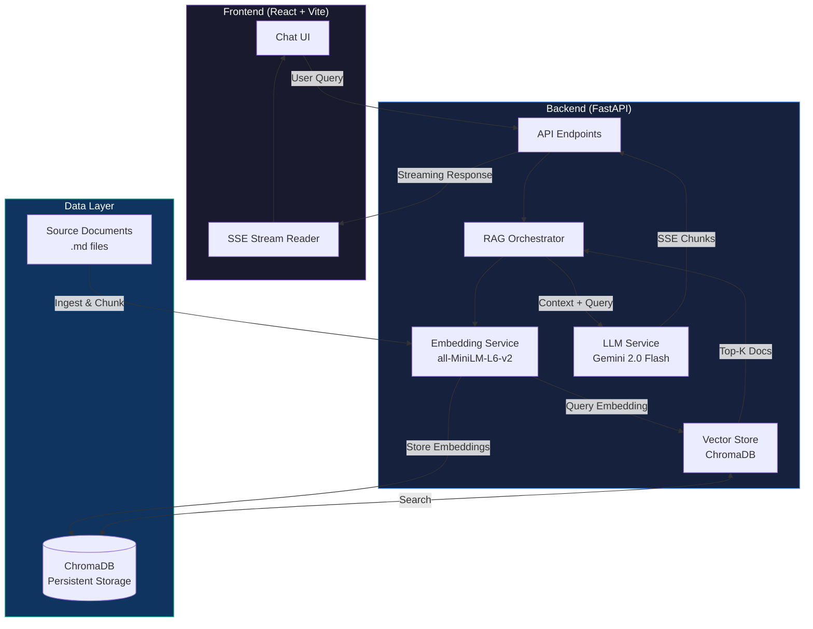

# 🧠 RAG System — Retrieval-Augmented Generation

A full-stack RAG system that retrieves relevant documents from a vector database and generates grounded responses using Google Gemini. Features **SSE streaming**, a **React chat interface**, and a **built-in evaluation framework**.

> Built with FastAPI, ChromaDB, Sentence-Transformers, and React.

## Architecture



### Key Features

- 🔍 **Semantic search** — Sentence-transformer embeddings with ChromaDB vector store
- ⚡ **Streaming** — Token-by-token SSE streaming for real-time responses
- 📊 **Evaluation** — Built-in metrics framework (precision, recall, faithfulness)
- 🎨 **Chat UI** — Dark-mode React frontend with source citations
- 🐳 **Docker Compose** — One-command full-stack deployment

---

## Quick Start

### Option 1: Docker Compose (Recommended)

```bash
# 1. Clone and configure
git clone <repo-url> && cd coding-exercise
cp backend/.env.example backend/.env
# Edit backend/.env — add your GEMINI_API_KEY

# 2. Start everything
docker-compose up --build

# 3. Ingest documents
curl -X POST http://localhost:8000/ingest

# 4. Open the UI
open http://localhost:5173
```

### Option 2: Local Development

#### Backend (Terminal 1)

```bash
cd backend
python3 -m venv venv
source venv/bin/activate
pip install -r requirements.txt

# Configure your Gemini API key
cp .env.example .env
# Edit .env and set GEMINI_API_KEY=your-key-here

# Ingest the source documents into ChromaDB
python -m data.ingest

# Start the backend server
uvicorn main:app --reload
# ✅ Backend running at http://localhost:8000
```

#### Frontend (Terminal 2)

```bash
cd frontend
npm install
npm run dev
# ✅ Frontend running at http://localhost:5173
```

> **Note:** The frontend proxies API requests to `http://localhost:8000` automatically via Vite config.

### Option 3: Ollama Only (No API Key Needed)

```bash
# Install Ollama: https://ollama.com
ollama serve
ollama pull llama3.2:3b

# Start backend with Ollama
cd backend
LLM_PROVIDER=ollama uvicorn main:app --reload
```

---

## API Endpoints

| Method | Path | Description |
|--------|------|-------------|
| `GET` | `/health` | Health check + model status |
| `POST` | `/query` | RAG query (JSON response) |
| `POST` | `/query/stream` | RAG query (SSE streaming) |
| `GET` | `/documents` | List indexed documents |
| `POST` | `/ingest` | Ingest documents from disk |
| `GET` | `/models` | List available LLM models |
| `POST` | `/models/select` | Switch LLM provider |

### Example Query

```bash
curl -X POST http://localhost:8000/query \
  -H "Content-Type: application/json" \
  -d '{"query": "Why is centering a div so hard?", "top_k": 3}'
```

---

## Evaluation

Run the built-in evaluation framework:

```bash
cd backend
python -m evaluation.evaluate
```

This runs 12 curated queries and measures:

| Metric | Description |
|--------|-------------|
| Context Precision | Was the correct source document retrieved? |
| Context Recall@K | Position of the correct source in results |
| Keyword Coverage | Do expected keywords appear in the answer? |
| Answer Length | Is the answer appropriately sized? |
| Faithfulness | Is the answer grounded in retrieved context? |

Results are printed as a table and saved to `evaluation_results.json`.

---

## Tech Stack

| Component | Technology |
|-----------|-----------|
| Backend | Python, FastAPI, Uvicorn |
| Vector DB | ChromaDB (embedded, persistent) |
| Embeddings | `all-MiniLM-L6-v2` (sentence-transformers) |
| LLM (Cloud) | Google Gemini 2.0 Flash |
| LLM (Local) | Ollama (llama3.2:3b) |
| Frontend | React 18, Vite |
| Infra | Docker Compose, Nginx |

## Design Decisions

1. **ChromaDB over Pinecone/Weaviate** — Zero external dependencies, embedded mode is perfect for a take-home. Persistent storage means data survives restarts.

2. **Sentence-Transformers over OpenAI embeddings** — Runs locally, free, no API key needed for the embedding step. `all-MiniLM-L6-v2` is small (80MB) but scores well on semantic similarity benchmarks.

3. **Dual LLM with toggle** — Gemini for quality (free tier), Ollama for fully offline/free operation. Toggle lets you compare responses from different models.

4. **SSE over WebSockets** — Simpler to implement, works through proxies, and is the standard for LLM streaming (used by ChatGPT, Claude, etc.).

5. **Custom evaluation over RAGAS** — Lightweight, no heavy dependencies, and more transparent. Each metric is <30 lines and easy to understand.

---

## Running Tests

```bash
cd backend
pip install -r requirements.txt
python -m pytest tests/ -v
```

---

## Project Structure

```
coding-exercise/
├── backend/
│   ├── main.py                  # FastAPI endpoints (query, stream, ingest, health)
│   ├── config.py                # Pydantic settings from .env
│   ├── models.py                # Request/response schemas
│   ├── Dockerfile               # Backend container
│   ├── requirements.txt         # Python dependencies
│   ├── services/
│   │   ├── embedding.py         # Sentence-transformer embeddings (all-MiniLM-L6-v2)
│   │   ├── vector_store.py      # ChromaDB operations
│   │   ├── llm.py               # Gemini LLM integration + streaming
│   │   └── rag.py               # RAG pipeline orchestration
│   ├── data/
│   │   ├── ingest.py            # Document chunking & ingestion
│   │   └── documents/           # Source .md files (knowledge base)
│   ├── evaluation/
│   │   ├── evaluate.py          # Evaluation runner
│   │   ├── metrics.py           # Precision, recall, faithfulness metrics
│   │   └── test_queries.json    # 12 curated test queries
│   └── tests/
│       ├── test_api.py          # API integration tests
│       ├── test_rag.py          # RAG evaluation tests
│       └── test_vector_store.py # Vector store unit tests
├── frontend/
│   ├── index.html               # Entry point
│   ├── vite.config.js           # Vite config + API proxy
│   ├── package.json             # Node dependencies
│   ├── Dockerfile               # Multi-stage build (Vite → Nginx)
│   ├── nginx.conf               # Nginx config for SPA + API proxy
│   └── src/
│       ├── main.jsx             # React entry
│       ├── App.jsx              # Main app + SSE streaming logic
│       ├── index.css            # Global styles (dark theme)
│       └── components/
│           ├── ChatInterface.jsx   # Message list + empty state
│           ├── Message.jsx         # Individual message rendering
│           ├── QueryInput.jsx      # Auto-resizing textarea input
│           ├── Sidebar.jsx         # Chat history sidebar
│           └── SourceDocuments.jsx  # Retrieved sources panel
├── docker-compose.yml           # Backend + Frontend orchestration
└── README.md
```

